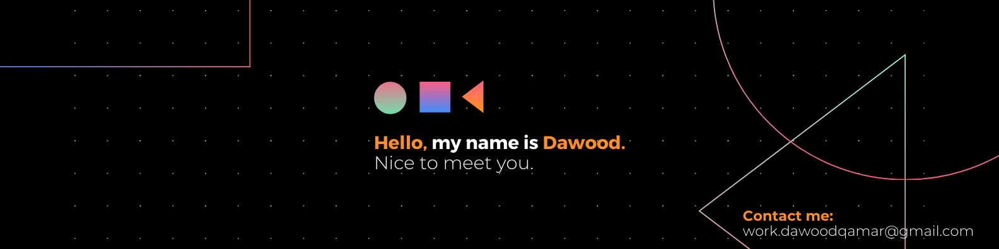
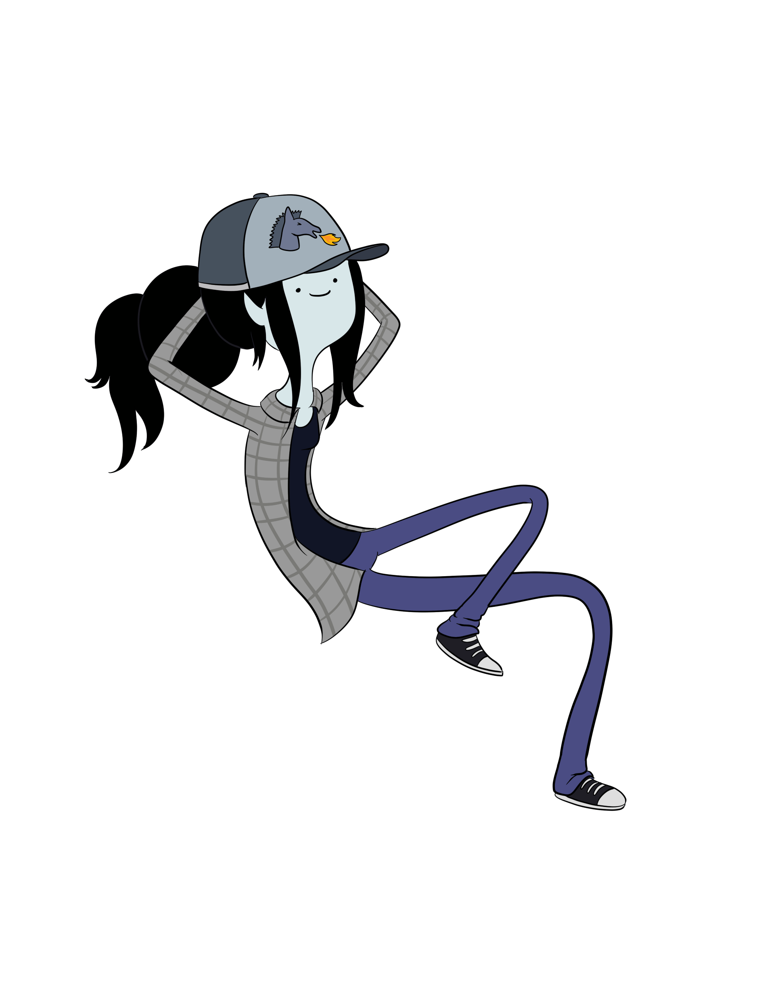

<div align="center">
    
</div>


```console
exeNyx7@github:~$ ./whoami.sh
```
<h3 align="left">&lt;/&gt; Welcome</h3> 


```
 _____________________________________
< Welcome to my personal GitHub page! />
< for more details: https://dawood-qamar.vercel.app/ />
 ------------------------------------- 
        \   ^__^
         \  (oo)\_______
            (__)\       )\/\
                ||----w |
                ||     ||
```


<h2 align="center">&lt;/&gt; About Me</h2>

<h3 align="left">&lt;/&gt; Introduction</h3> 

```csharp
    Human Information
    ------------------------------------------
    Name: Dawood
    Lastname: Qamar
    Nickname: exeNyx7
    Education: Software Engineering @ FAST-NUCES
    Interests: ["Web Development"], ["DevOps"], ["System Design"], ["AI/ML"]
    Languages: ["English"], ["Urdu"]
    Location: Islamabad, Pakistan
```


<h2 align="center">&lt;/&gt; Professional Overview</h2> 

```csharp
    Professional Strengths
    ------------------------------------------
    - 🚀 Full-stack development with modern technologies
    - 🔧 Software architecture and system design
    - 🛠️ DevOps practices and cloud infrastructure
    - 🎨 UI/UX design with industry-standard tools
    - 🔍 Quality assurance and testing methodologies
    - 📊 Database management and optimization
    - 🎯 Strong problem-solving capabilities

    Education
    ------------------------------------------
    - **Bachelor of Science in Software Engineering**
      - FAST National University of Computer and Emerging Sciences, Islamabad
      - Expected Graduation: 2026
      - Focus Areas: Software Design, Systems Architecture, Cloud Computing

    Professional Experience
    ------------------------------------------
    **Full Stack Developer Intern** | Tier5 Solutions
    - Summer 2024
    - Developed and maintained scalable web applications using modern JavaScript frameworks
    - Collaborated with cross-functional teams to implement robust solutions
    - Contributed to both frontend and backend development lifecycles
    - Utilized agile methodologies for project delivery

```



### Employer?
> [!IMPORTANT]  
> <a href="https://drive.google.com/drive/u/2/folders/1xHGbixJcfAEUZsCzop99SKtnhFOqHCar" download>Download my resume</a>
<br><br><br>
<br><br><br>

<h2 align="center">&lt;/&gt; Technical Proficiency</h2>
<h3 align="left">&lt;/&gt; Programming Languages</h3>
<div align="center">
    <table align="left">
        <tr>
            <td align="center" width="110" height="90">
                
                <br />
            </td>
            <td align="center" width="110" height="90">
                
                <br />
            </td>
            <td align="center" width="110" height="90">
                
                <br />
            </td>
            <td align="center" width="110" height="90">
                
                <br />
            </td>
        </tr>
        <tr>
            <td align="center" width="110" height="90">
                
                <br />
            </td>
            <td align="center" width="110" height="90">
                
                <br />
            </td>
            <td align="center" width="110" height="90">
                
                <br />
            </td>
            <td align="center" width="110" height="90">
                
                <br />
            </td>
        </tr>
    </table>
    <br />
    
    <br />
</div>


<h3 align="left">&lt;/&gt; Tools & Technologies</h3> 
<div align="left">
    <table align="left">
        <tr>
            <td align="center" width="110" height="90">
                
            </td>
            <td align="center" width="110" height="90">
                
            </td>
            <td align="center" width="110" height="90">
                
            </td>
            <td align="center" width="110" height="90">
                
            </td>
        </tr>
        <tr>
            <td align="center" width="110" height="90">
                
            </td>
            <td align="center" width="110" height="90">
                
            </td>
            <td align="center" width="110" height="90">
                
            </td>
            <td align="center" width="110" height="90">
                
            </td>
        </tr>
        <tr>
            <td align="center" width="110" height="90">
                
            </td>
            <td align="center" width="110" height="90">
                
            </td>
            <td align="center" width="110" height="90">
                
            </td>
            <td align="center" width="110" height="90">
                
            </td>
        </tr>
        <tr>
            <td align="center" width="110" height="90">
                
            </td>
            <td align="center" width="110" height="90">
                
            </td>
            <td align="center" width="110" height="90">
                
            </td>
            <td align="center" width="110" height="90">
                
            </td>
        </tr>
        <tr>
            <td align="center" width="110" height="90">
                
            </td>
            <td align="center" width="110" height="90">
                
            </td>
        </tr>
    </table>
</div>

<br> 
<h3 align="center">&lt;/&gt; Frameworks & Libraries</h3>
<div align="center">
    <table align="center">
        <tr>
            <td align="center" width="110" height="90">
                
            </td>
            <td align="center" width="110" height="90">
                
            </td>
        </tr>
        <tr>    
        </tr>
            <td align="center" width="110" height="90">
                
            </td>
            <td align="center" width="110" height="90">
                
            </td>
        <tr>
            </tr>
            <td align="center" width="110" height="90">
                
            </td>
            <td align="center" width="110" height="90">
                
            </td>
            <tr>
            <td align="center" width="110" height="90">
                
            </td>
            <td align="center" width="110" height="90">
                
            </td>
        </tr>
    </table>
</div>


<div align="center">
    <br><br>
    <br><br>
<h2 align="center">&lt;/&gt; Stats & Activity</h2>
    
    <br>
    <br>
</div>


<div align="center">
  <a href="#" alt="Most used languages">
    
  </a>

  <a href="#" alt="github stats">
    
  </a>
</div>

<div align="center">
  <a href="https://git.io/streak-stats">
    <br>
    
  </a>
</div>

<h2 align="center">&lt;/&gt; Let's Connect</h2>

<br clear="both">

<div align="center">
  <a href="https://www.linkedin.com/in/dawood-qamar/" target="_blank">
    
  </a>
  <a href="https://discordapp.com/users/432108089106235392" target="_blank">
    
  </a>
  <a href="work.dawoodqamar@gmail.com" target="_blank">
    
  </a>
</div>


